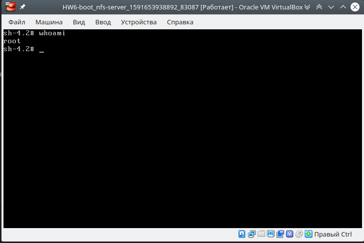
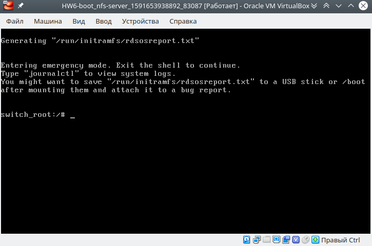
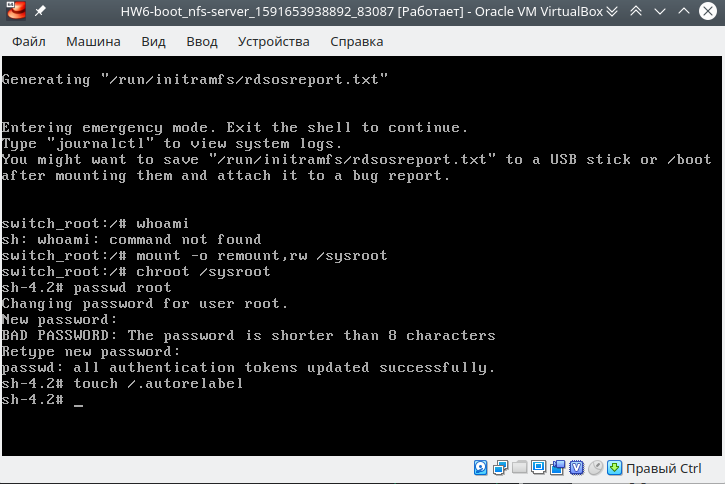
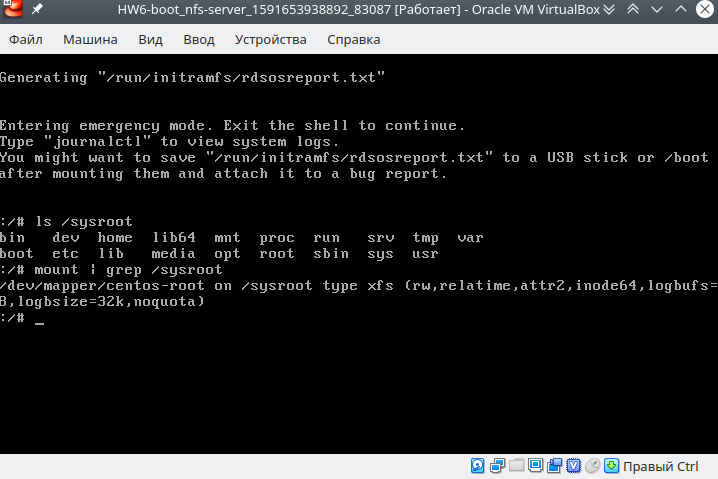

# OS boot

- [OS boot](#os-boot)
  - [LogIn without password](#login-without-password)
    - [init](#init)
    - [rd.break](#rdbreak)
    - [rw init sysroot](#rw-init-sysroot)

## LogIn without password

First open VirtualBox.
Then run vagrant VM
```shell
vagrant up
```
and stop boot brocess on grub boot menu.

### init

1. Select grub menu item by arrows up/down and press `e` to edit it.
2. Add `init=/bin/sh` at end of line started with `linux16`
   
3. Press `ctrl+x` to boot with updated menu item... And we're in!
   
4. Remount rootfs with write access
   ```shell
   mount -o remount,rw /
   ```
5. Profit!


### rd.break

1. Select grub menu item by arrows up/down and press `e` to edit it.
2. Add `rd.break` at end of line started with `linux16`
   
3. Press `ctrl+x` to boot with updated menu item... And we're in!
   
4. Now root filesystem is available at `/sysroot`. Remount it readwrite
   ```shell
   mount -o remount,rw /sysroot
   ```
5. Chroot to `/sysroot` and change `root` password
   ```shell
   chroot /sysroot
   passwd root
   touch /.autorelabel
   ```
   
6. Then exit chroot, reboot and try to login as root with new password
   

### rw init sysroot

1. Select grub menu item by arrows up/down and press `e` to edit it.
2. Replace `ro` to `rw` and append `init=/sysroot/bin/sh` at end of line started with `linux16`
   
3. Press `ctrl+x` to boot with updated menu item... And we're in!
   
4. And we already have write access to sysroot
   
